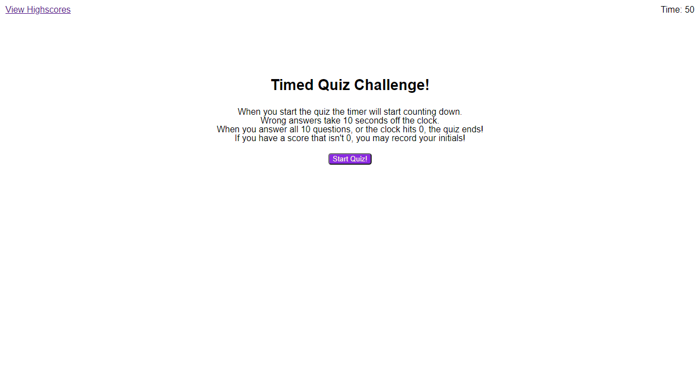

# u04-timed-quiz
Timed quiz HW for Unit 04 of FS Dev

## Description of application

This timed quiz application has 5 placeholder questions and answers.

The purpose is to show that a quiz application that runs, keeps track of correct/incorrect answers, stores highscores (locally to browser), and keeps the highscore list no longer than 10 slots.

The quiz is repeatable.

The timer starts at 50 seconds.
Getting a wrong answer takes 10 seconds off the clock.

You may only submit your score if you achive a score (timer > 0).

[Deployed Application](https://epowelldev.github.io/u04-timed-quiz/)

[GitHub Repo](https://github.com/epowelldev/u04-timed-quiz)
